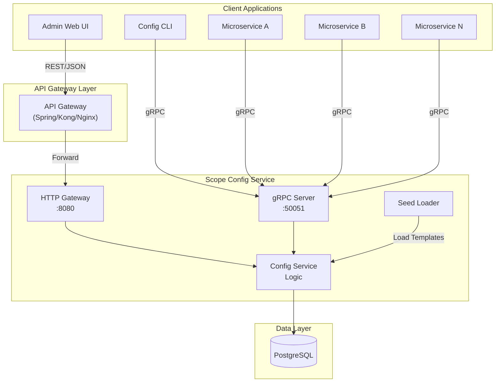
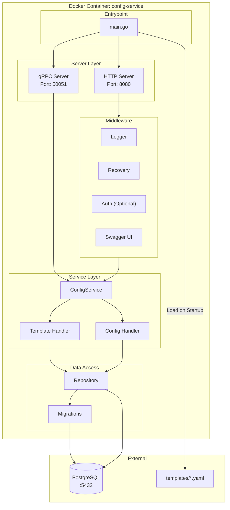
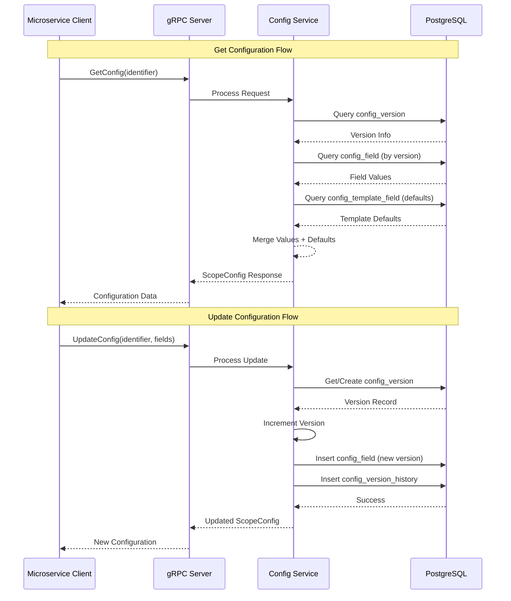
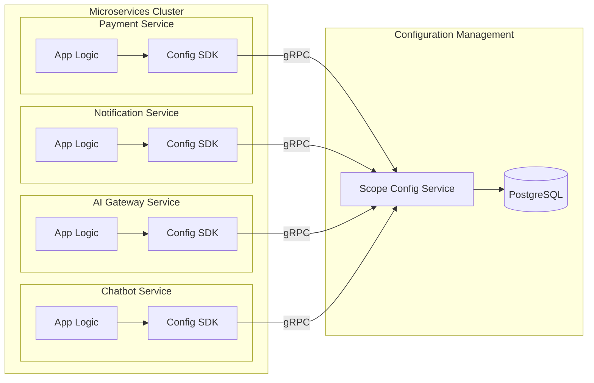
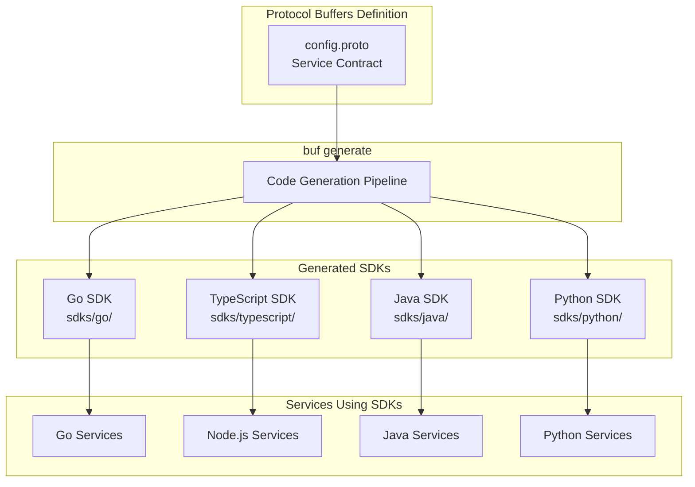
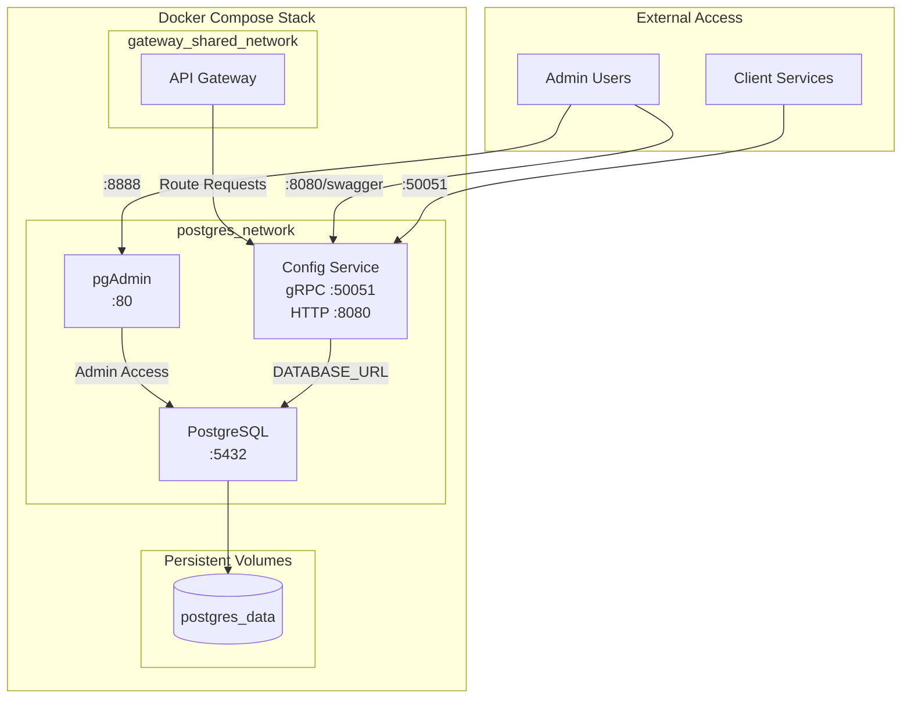
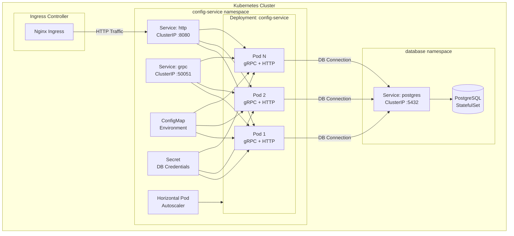
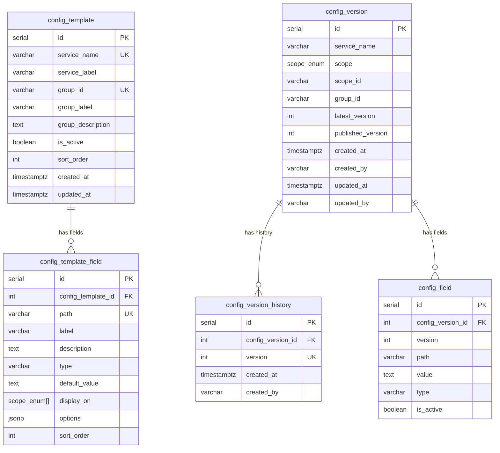
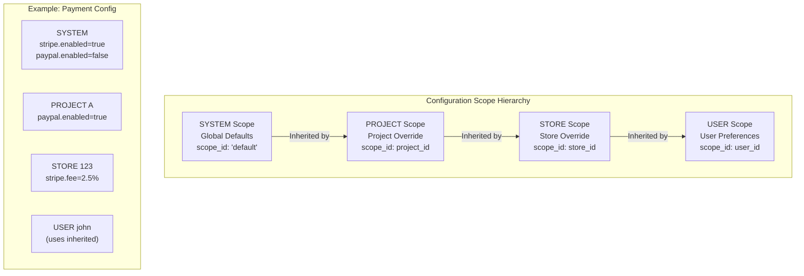
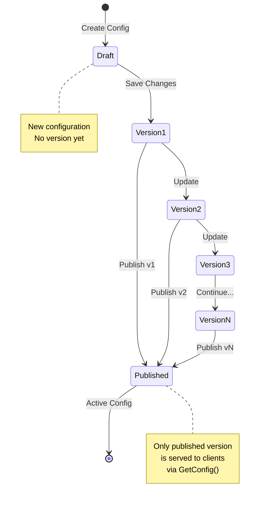

# Scope Config Service - Technical Proposal

## Executive Summary

**Scope Config Service** is a centralized configuration management system designed for microservices ecosystems. It provides high-throughput, scalable, and version-controlled configuration management with schema-driven validation, multi-scope support, and real-time distribution capabilities.

---

## 1. Problem Statement

In modern microservices architectures, managing configurations across dozens or hundreds of services presents significant challenges:

| Challenge | Impact |
|-----------|--------|
| **Configuration Sprawl** | Each service maintains its own configuration files, leading to inconsistency and duplication |
| **Environment Management** | Handling configurations across dev, staging, and production environments becomes error-prone |
| **Audit & Compliance** | Tracking who changed what, when, and why is difficult without centralized control |
| **Scalability** | Traditional file-based configurations don't scale well with growing microservices |
| **Real-time Updates** | Rolling out configuration changes requires service restarts or redeployments |
| **Multi-tenancy** | Supporting different configurations for different projects, stores, or users is complex |

---

## 2. Solution Overview

Scope Config Service addresses these challenges by providing:

- **Centralized Configuration Hub**: Single source of truth for all service configurations
- **Schema-Driven Validation**: YAML templates define configuration structure, types, and defaults
- **Multi-Scope Hierarchy**: Support for SYSTEM, PROJECT, STORE, and USER level configurations
- **Version Control**: Immutable versions with complete audit trail
- **High-Throughput API**: gRPC for internal services + HTTP REST for external access
- **Real-time Distribution**: Configurations can be fetched on-demand with minimal latency

---

## 3. System Architecture

### 3.1 High-Level Architecture



### 3.2 Service Container Architecture



### 3.3 Data Flow Architecture



---

## 4. Microservices Ecosystem Integration

### 4.1 Service Integration Pattern



### 4.2 Multi-Language SDK Support



---

## 5. Infrastructure Architecture

### 5.1 Docker Compose Deployment



### 5.2 Production Kubernetes Deployment



---

## 6. Database Schema

### 6.1 Entity Relationship Diagram



---

## 7. Key Features

### 7.1 Configuration Scoping



### 7.2 Version Control & Publishing



---

## 8. API Summary

### 8.1 gRPC API (Internal Services)

| RPC Method | Description |
|------------|-------------|
| `GetConfig` | Get published configuration |
| `GetLatestConfig` | Get latest version (published or draft) |
| `GetConfigByVersion` | Get specific version |
| `GetConfigHistory` | Get version history |
| `UpdateConfig` | Create/update configuration (creates new version) |
| `PublishVersion` | Publish a specific version |
| `DeleteConfig` | Delete configuration and all versions |
| `ApplyConfigTemplate` | Apply configuration schema |
| `GetConfigTemplate` | Get template schema |
| `ListConfigTemplates` | List all templates |

### 8.2 HTTP REST API (External Access)

| Method | Endpoint | Description |
|--------|----------|-------------|
| `GET` | `/api/v1/config/templates` | List all templates |
| `GET` | `/api/v1/config/{service}/template` | Get service template |
| `GET` | `/api/v1/config/{service}/scope/{scope}` | Get published config |
| `PUT` | `/api/v1/config/{service}/scope/{scope}` | Update config |
| `GET` | `/api/v1/config/{service}/scope/{scope}/latest` | Get latest config |
| `GET` | `/api/v1/config/{service}/scope/{scope}/history` | Get version history |
| `POST` | `/api/v1/config/{service}/scope/{scope}/publish` | Publish version |

---

## 9. Performance & Scalability

### 9.1 High Throughput Design

- **gRPC Protocol**: Binary serialization, HTTP/2 multiplexing, bidirectional streaming
- **Connection Pooling**: Database connection reuse
- **Stateless Architecture**: Horizontal scaling without session affinity
- **Caching Strategy**: Client-side caching with version-based invalidation

### 9.2 Scalability Targets

| Metric | Target |
|--------|--------|
| Read Requests/Second | 10,000+ |
| Write Requests/Second | 1,000+ |
| Configuration Count | 100,000+ |
| Response Latency (p99) | <50ms |
| Concurrent Connections | 5,000+ |

---

## 10. Security Considerations

- **Authentication**: Delegated to API Gateway (OAuth2/JWT)
- **Authorization**: Role-based access control at gateway level
- **Sensitive Data**: `SECRET` field type for API keys/credentials (masked in UI)
- **Audit Trail**: Complete version history with user attribution
- **TLS**: gRPC supports TLS for encrypted transport

---

## 11. Getting Started

### Quick Start with Docker Compose

```bash
# Clone the repository (replace with your repository URL)
git clone <repository-url>
cd scope-config-service

# Configure environment
cp .env.example .env

# Start services
docker compose -f compose.postgres.yml -f compose.yml up -d --build

# Access points:
# - gRPC: localhost:50051
# - HTTP: http://localhost:8080
# - Swagger: http://localhost:8080/swagger/index.html
# - pgAdmin: http://localhost:8888
```

### Using the CLI

```bash
# Apply a template
docker compose exec config-service config-cli template apply -f /app/templates/payment.yaml

# Set configuration
docker compose exec config-service config-cli set \
    --service-name=payment \
    --scope=PROJECT \
    --project-id=proj-123 \
    --group-id=stripe \
    stripe.enabled=true

# Get configuration
docker compose exec config-service config-cli get \
    --service-name=payment \
    --scope=PROJECT \
    --project-id=proj-123 \
    --group-id=stripe

# Publish configuration
docker compose exec config-service config-cli publish 1 \
    --service-name=payment \
    --scope=PROJECT \
    --project-id=proj-123 \
    --group-id=stripe
```

---

## 12. Conclusion

Scope Config Service provides a robust, scalable solution for centralized configuration management in microservices ecosystems. Its schema-driven approach ensures consistency, while version control and multi-scope support enable flexible, auditable configuration management across complex distributed systems.

---

## References

- [README.md](../README.md) - Project overview and setup
- [HTTP Gateway Documentation](./HTTP_GATEWAY.md) - REST API details
- [Protocol Buffers Definition](../proto/config/v1/config.proto) - gRPC contract
- [Template Examples](../templates/) - Configuration schema examples
