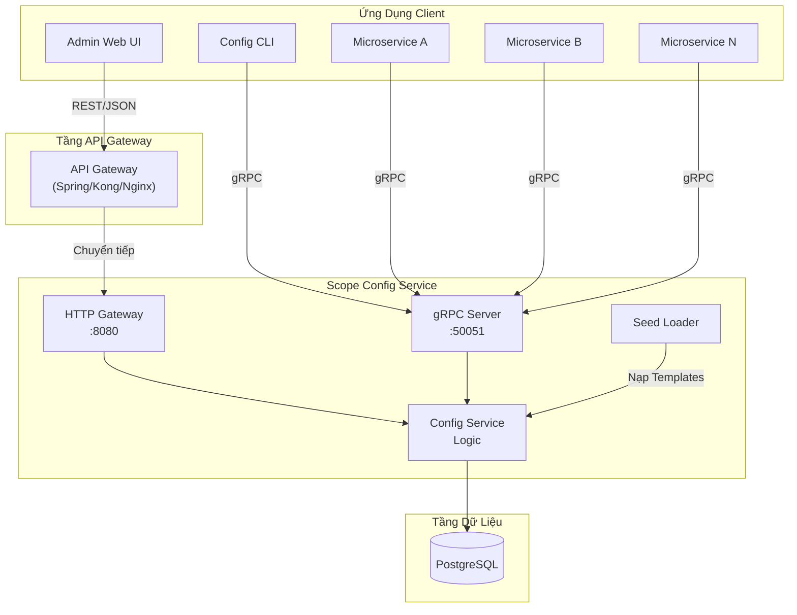
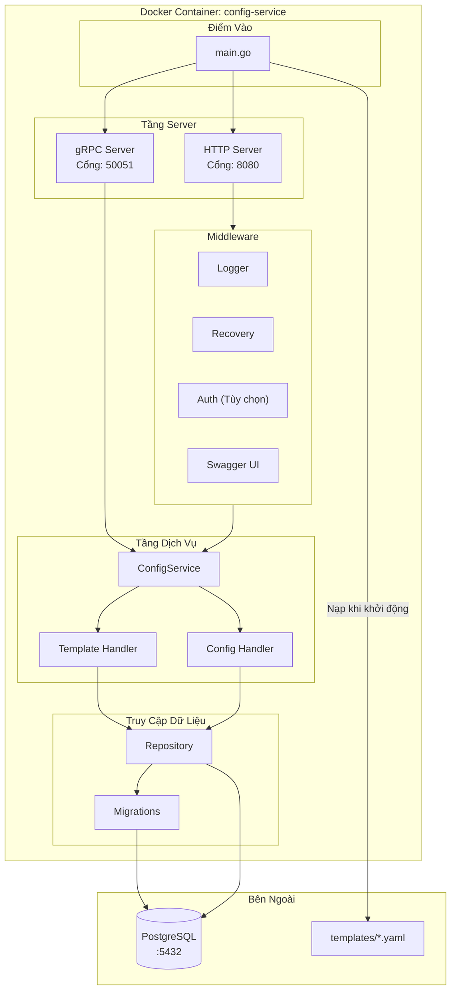
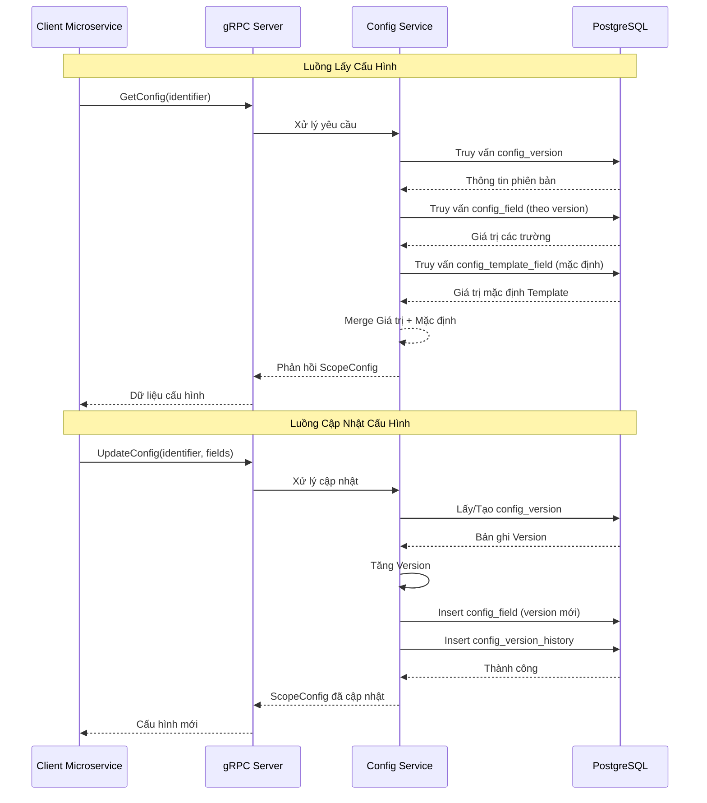
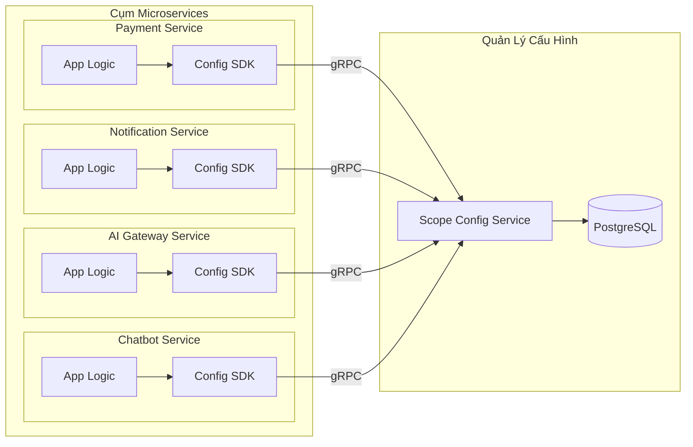
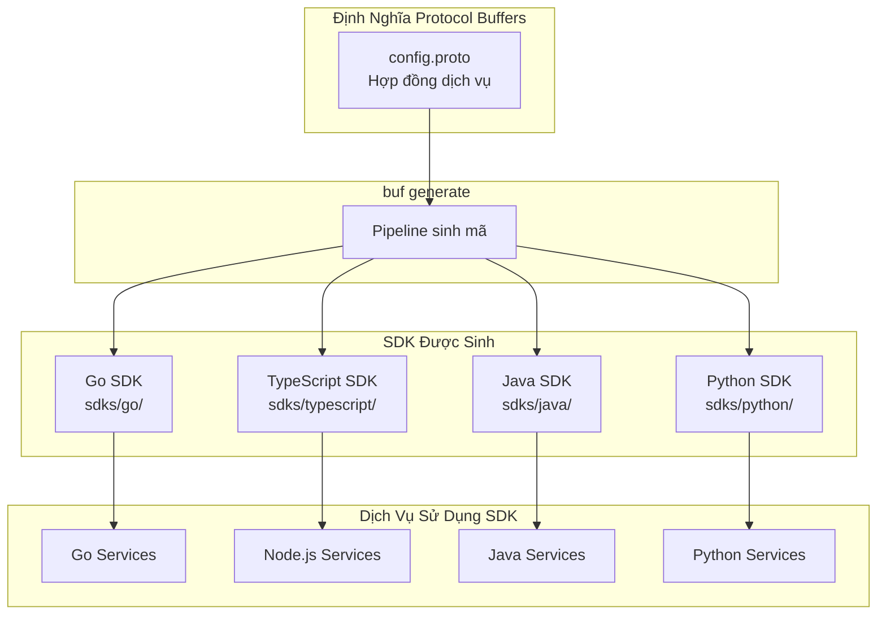
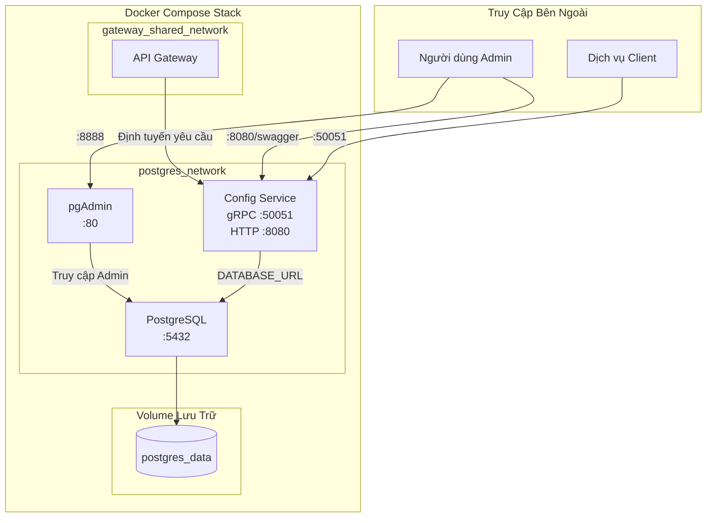
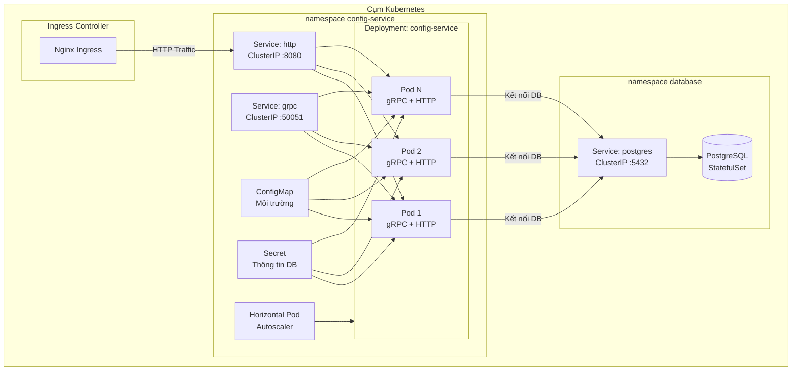
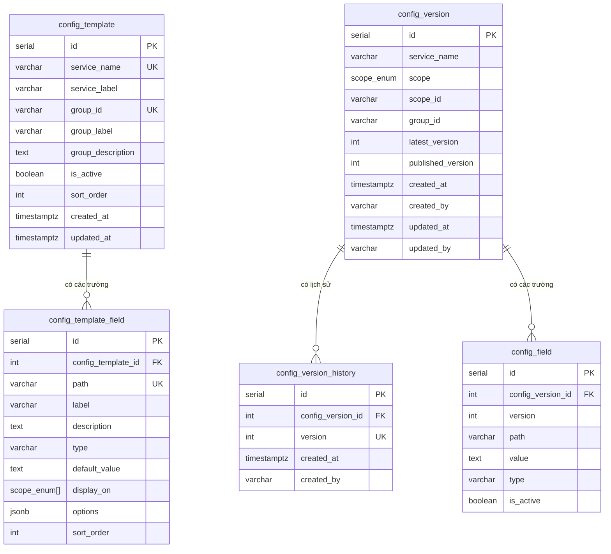
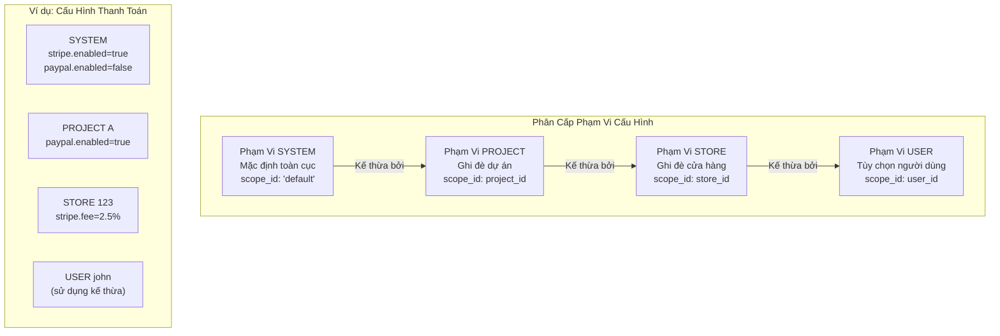
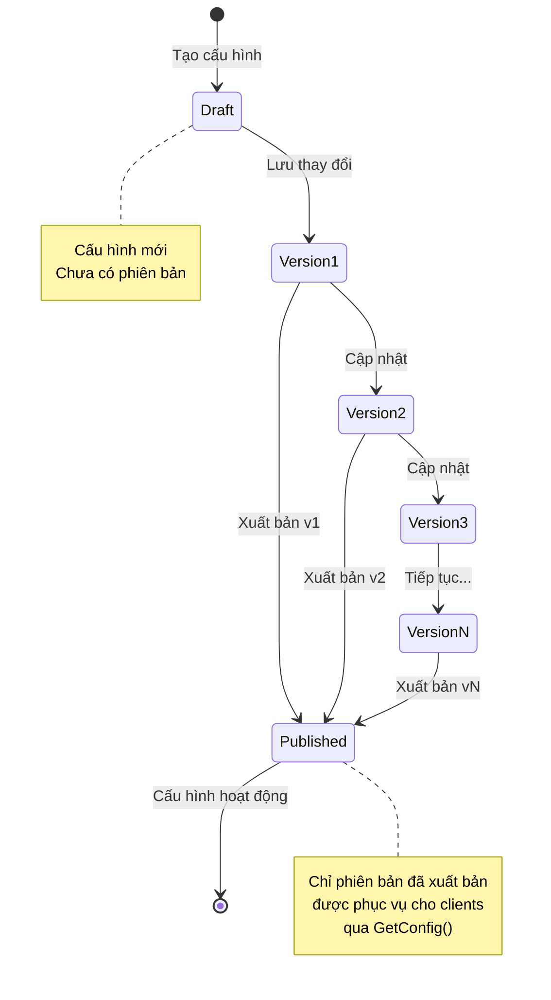

# Scope Config Service - Đề Xuất Kỹ Thuật

## Tóm Tắt

**Scope Config Service** là hệ thống quản lý cấu hình tập trung được thiết kế cho hệ sinh thái microservices. Dịch vụ cung cấp khả năng quản lý cấu hình có thông lượng cao, khả năng mở rộng, kiểm soát phiên bản, xác thực theo schema, hỗ trợ đa phạm vi và phân phối thời gian thực.

---

## 1. Phát Biểu Vấn Đề

Trong kiến trúc microservices hiện đại, việc quản lý cấu hình trên hàng chục hoặc hàng trăm dịch vụ đặt ra nhiều thách thức đáng kể:

| Thách Thức | Tác Động |
|------------|----------|
| **Phân tán cấu hình** | Mỗi dịch vụ duy trì file cấu hình riêng, dẫn đến không nhất quán và trùng lặp |
| **Quản lý môi trường** | Xử lý cấu hình qua các môi trường dev, staging và production dễ phát sinh lỗi |
| **Kiểm toán & Tuân thủ** | Theo dõi ai đã thay đổi gì, khi nào và tại sao rất khó khăn nếu không có kiểm soát tập trung |
| **Khả năng mở rộng** | Cấu hình dựa trên file truyền thống không mở rộng tốt khi microservices tăng lên |
| **Cập nhật thời gian thực** | Triển khai thay đổi cấu hình yêu cầu khởi động lại hoặc triển khai lại dịch vụ |
| **Đa thuê bao** | Hỗ trợ cấu hình khác nhau cho các dự án, cửa hàng hoặc người dùng khác nhau rất phức tạp |

---

## 2. Tổng Quan Giải Pháp

Scope Config Service giải quyết các thách thức này bằng cách cung cấp:

- **Hub Cấu Hình Tập Trung**: Nguồn thông tin duy nhất cho tất cả cấu hình dịch vụ
- **Xác Thực Theo Schema**: Template YAML định nghĩa cấu trúc, kiểu dữ liệu và giá trị mặc định
- **Phân Cấp Đa Phạm Vi**: Hỗ trợ cấu hình cấp SYSTEM, PROJECT, STORE và USER
- **Kiểm Soát Phiên Bản**: Các phiên bản bất biến với lịch sử kiểm toán đầy đủ
- **API Thông Lượng Cao**: gRPC cho dịch vụ nội bộ + HTTP REST cho truy cập bên ngoài
- **Phân Phối Thời Gian Thực**: Cấu hình có thể được lấy theo yêu cầu với độ trễ tối thiểu

---

## 3. Kiến Trúc Hệ Thống

### 3.1 Kiến Trúc Tổng Quan



### 3.2 Kiến Trúc Container Dịch Vụ



### 3.3 Kiến Trúc Luồng Dữ Liệu



---

## 4. Tích Hợp Hệ Sinh Thái Microservices

### 4.1 Mô Hình Tích Hợp Dịch Vụ



### 4.2 Hỗ Trợ SDK Đa Ngôn Ngữ



---

## 5. Kiến Trúc Hạ Tầng

### 5.1 Triển Khai Docker Compose



### 5.2 Triển Khai Production Kubernetes



---

## 6. Schema Cơ Sở Dữ Liệu

### 6.1 Sơ Đồ Quan Hệ Thực Thể



---

## 7. Các Tính Năng Chính

### 7.1 Phạm Vi Cấu Hình



### 7.2 Kiểm Soát Phiên Bản & Xuất Bản



---

## 8. Tóm Tắt API

### 8.1 API gRPC (Dịch Vụ Nội Bộ)

| Phương Thức RPC | Mô Tả |
|-----------------|-------|
| `GetConfig` | Lấy cấu hình đã xuất bản |
| `GetLatestConfig` | Lấy phiên bản mới nhất (đã xuất bản hoặc bản nháp) |
| `GetConfigByVersion` | Lấy phiên bản cụ thể |
| `GetConfigHistory` | Lấy lịch sử phiên bản |
| `UpdateConfig` | Tạo/cập nhật cấu hình (tạo phiên bản mới) |
| `PublishVersion` | Xuất bản phiên bản cụ thể |
| `DeleteConfig` | Xóa cấu hình và tất cả phiên bản |
| `ApplyConfigTemplate` | Áp dụng schema cấu hình |
| `GetConfigTemplate` | Lấy schema template |
| `ListConfigTemplates` | Liệt kê tất cả templates |

### 8.2 API HTTP REST (Truy Cập Bên Ngoài)

| Phương Thức | Endpoint | Mô Tả |
|-------------|----------|-------|
| `GET` | `/api/v1/config/templates` | Liệt kê tất cả templates |
| `GET` | `/api/v1/config/{service}/template` | Lấy template dịch vụ |
| `GET` | `/api/v1/config/{service}/scope/{scope}` | Lấy cấu hình đã xuất bản |
| `PUT` | `/api/v1/config/{service}/scope/{scope}` | Cập nhật cấu hình |
| `GET` | `/api/v1/config/{service}/scope/{scope}/latest` | Lấy cấu hình mới nhất |
| `GET` | `/api/v1/config/{service}/scope/{scope}/history` | Lấy lịch sử phiên bản |
| `POST` | `/api/v1/config/{service}/scope/{scope}/publish` | Xuất bản phiên bản |

---

## 9. Hiệu Suất & Khả Năng Mở Rộng

### 9.1 Thiết Kế Thông Lượng Cao

- **Giao Thức gRPC**: Tuần tự hóa nhị phân, ghép kênh HTTP/2, streaming hai chiều
- **Connection Pooling**: Tái sử dụng kết nối cơ sở dữ liệu
- **Kiến Trúc Stateless**: Mở rộng ngang không cần session affinity
- **Chiến Lược Cache**: Cache phía client với vô hiệu hóa dựa trên phiên bản

### 9.2 Mục Tiêu Khả Năng Mở Rộng

| Chỉ Số | Mục Tiêu |
|--------|----------|
| Yêu cầu Đọc/Giây | 10,000+ |
| Yêu cầu Ghi/Giây | 1,000+ |
| Số Lượng Cấu Hình | 100,000+ |
| Độ Trễ Phản Hồi (p99) | <50ms |
| Kết Nối Đồng Thời | 5,000+ |

---

## 10. Cân Nhắc Bảo Mật

- **Xác Thực**: Ủy quyền cho API Gateway (OAuth2/JWT)
- **Phân Quyền**: Kiểm soát truy cập dựa trên vai trò tại tầng gateway
- **Dữ Liệu Nhạy Cảm**: Kiểu trường `SECRET` cho API keys/credentials (ẩn trong UI)
- **Lịch Sử Kiểm Toán**: Lịch sử phiên bản đầy đủ với thuộc tính người dùng
- **TLS**: gRPC hỗ trợ TLS cho truyền tải mã hóa

---

## 11. Bắt Đầu

### Khởi Động Nhanh với Docker Compose

```bash
# Clone repository (thay thế bằng URL repository của bạn)
git clone <repository-url>
cd scope-config-service

# Cấu hình môi trường
cp .env.example .env

# Khởi động dịch vụ
docker compose -f compose.postgres.yml -f compose.yml up -d --build

# Các điểm truy cập:
# - gRPC: localhost:50051
# - HTTP: http://localhost:8080
# - Swagger: http://localhost:8080/swagger/index.html
# - pgAdmin: http://localhost:8888
```

### Sử Dụng CLI

```bash
# Áp dụng template
docker compose exec config-service config-cli template apply -f /app/templates/payment.yaml

# Thiết lập cấu hình
docker compose exec config-service config-cli set \
    --service-name=payment \
    --scope=PROJECT \
    --project-id=proj-123 \
    --group-id=stripe \
    stripe.enabled=true

# Lấy cấu hình
docker compose exec config-service config-cli get \
    --service-name=payment \
    --scope=PROJECT \
    --project-id=proj-123 \
    --group-id=stripe

# Xuất bản cấu hình
docker compose exec config-service config-cli publish 1 \
    --service-name=payment \
    --scope=PROJECT \
    --project-id=proj-123 \
    --group-id=stripe
```

---

## 12. Kết Luận

Scope Config Service cung cấp giải pháp mạnh mẽ, có khả năng mở rộng cho quản lý cấu hình tập trung trong hệ sinh thái microservices. Cách tiếp cận hướng schema đảm bảo tính nhất quán, trong khi kiểm soát phiên bản và hỗ trợ đa phạm vi cho phép quản lý cấu hình linh hoạt, có thể kiểm toán trên các hệ thống phân tán phức tạp.

---

## Tài Liệu Tham Khảo

- [README.md](../README.md) - Tổng quan dự án và thiết lập
- [Tài liệu HTTP Gateway](./HTTP_GATEWAY.md) - Chi tiết REST API
- [Định nghĩa Protocol Buffers](../proto/config/v1/config.proto) - Hợp đồng gRPC
- [Ví dụ Template](../templates/) - Ví dụ schema cấu hình
